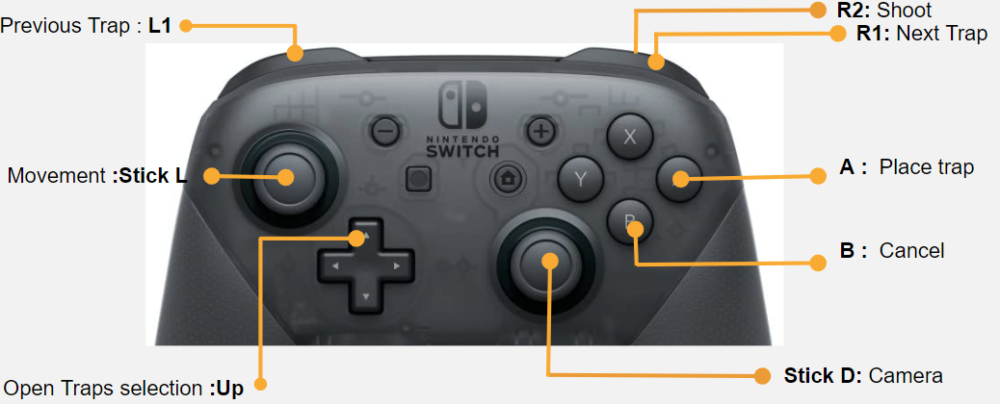
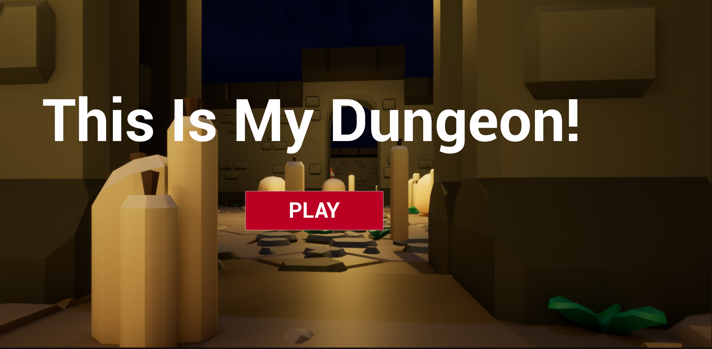
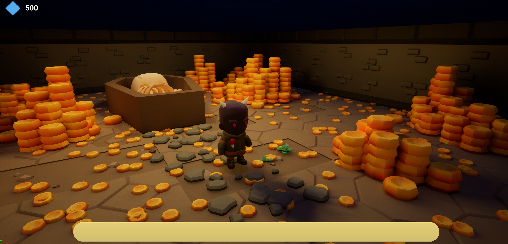
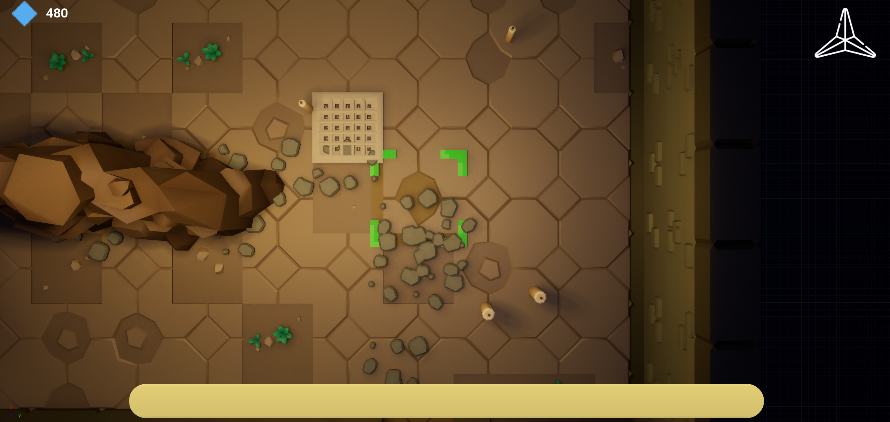
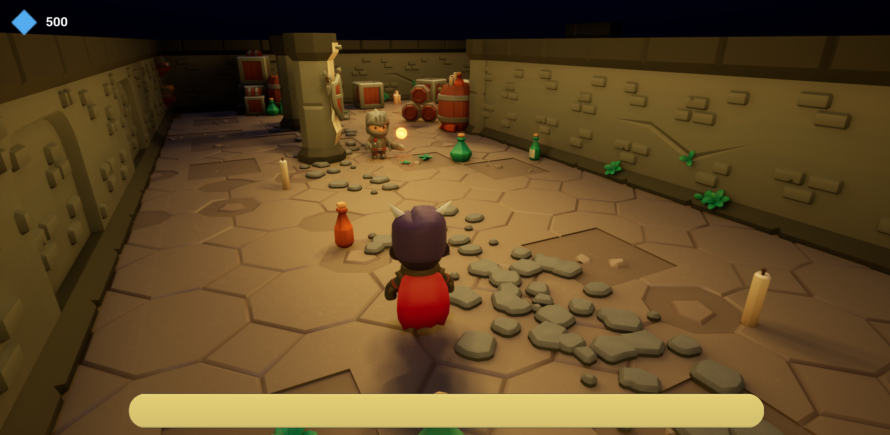
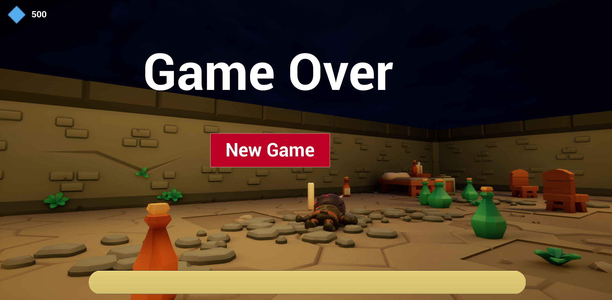

# This is my Dungeon

## ⭐ About the Project
The TPS is a 4 week project and was made using . The objective of this project was to make a console game with Unreal Engine.

## 📑 Information
In This is my Dungeon, you have to protect your dungeon from heroes trying to seal your treasure. You have at your disposal fireballs and traps.

### Controls :

### Features :
- Trap system:
    - Trap Placer
    - Traps:
        - Liquid
        - Spike
        - Canon
- Enemies:
    - Knight
    - Barbarian
    - Rogue
- Precedural Dungeon

## 📷 ScreenShots

## ✒ Authors
- <a href = "mailto: m.robion@student.isartdigital.com">Mathieu Robion</a>
- <a href = "mailto: jessicaperrochaud@gmail.com">Jessica Perrochaud</a>
- <a href = "mailto: m.leguevacques@student.isartdigital.com">Maxime Leguevacques</a>